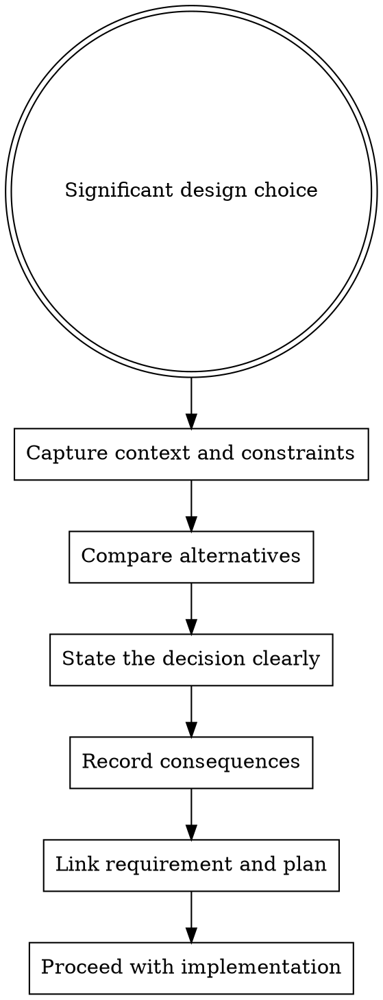

# Architecture Decision Records

Use an ADR when the change is really a decision, not just an implementation detail. The goal is to capture why a path was chosen before the code cements it.

## When To Use

- new module or package boundaries
- public API contract changes
- competing architecture choices
- new patterns that differ from existing conventions
- decisions that would be expensive to reverse later

## Workflow

## Rules

- write the ADR before the implementation locks the choice in place
- record real alternatives, not strawmen
- state consequences honestly, including downsides
- link the ADR to the requirement and plan that use it

## Red Flags

Stop if:

- the change introduces a durable design choice with no recorded rationale
- alternatives are being skipped because one option already feels convenient
- the decision affects public contracts but is only described in code or chat
- the downsides are being hidden to make the choice sound cleaner

## Companion Files

- `adr-template.md`
- `references/decision-triggers.md`

## Runtime Agent

- In OpenCode, prefer `@architect` when the work is primarily architectural.
