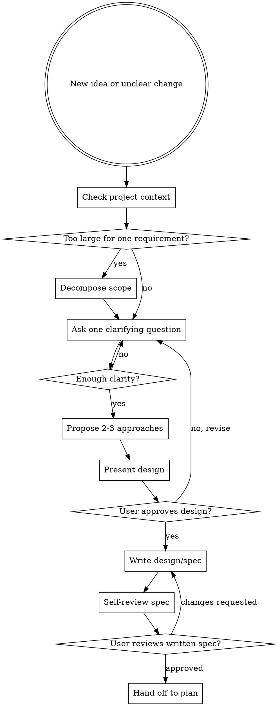

# Brainstorming

Turn rough ideas into an approved design or spec before planning or implementation.

## Hard Gate

Do not load `plan`, `tdd`, or any implementation workflow until you have presented a design and the user has approved it. This applies to every project regardless of perceived simplicity.

## Anti-Pattern: "This Is Too Simple To Need A Design"

Every project goes through this process. A todo list, a single-function utility, a config change — all of them. "Simple" projects are where unexamined assumptions cause the most wasted work. The design can be short (a few sentences for truly simple projects), but you MUST present it and get approval before planning or implementing.

## When To Use

- new features
- behavior changes
- design-heavy requests
- requests that still leave room for materially different implementations

Do not use this for already-approved, fully-specified tasks. For those, go straight to `plan` or `executing-plans`.

## Workflow

## Process

### 1. Explore Context

- inspect the existing project shape first
- identify relevant patterns, constraints, and docs
- detect when the request is really multiple subsystems

### 2. Scope Check Before Detail Questions

Before asking detailed questions, assess scope:

- if the request describes multiple independent subsystems (e.g., "build a platform with chat, file storage, billing, and analytics"), **flag this immediately**
- do not spend questions refining details of a project that needs to be decomposed first
- if the project is too large for a single spec, help the user decompose: what are the independent pieces, how do they relate, what order should they be built? Each sub-project then gets its own spec → plan → implementation cycle

If the request involves visual or interaction questions (UI, layout, flow), offer a handoff to the `design` skill — that is its own message, not combined with clarifying questions.

### 3. Clarify One Question At A Time

Ask one question per message.

Focus on:

- user problem
- success criteria
- constraints
- out-of-scope boundaries
- edge cases that would change the design

### 3. Explore Approaches

Once the request is clear enough, propose 2-3 approaches.

- lead with the recommendation
- explain trade-offs briefly
- keep the options grounded in the actual repo context

### 4. Present The Design

Present the design in sections scaled to complexity.

Cover what matters:

- behavior
- architecture and boundaries
- data flow or state changes
- failure handling
- testing expectations

### 5. Write The Design / Spec

Once the user approves the design, write it down before planning.

Keep it explicit enough that a planner can decompose it without guessing.

### 6. Self-Review The Written Spec

Before handing off:

- scan for placeholders
- remove ambiguity
- check for contradictions
- confirm it is scoped tightly enough for one plan

### 7. User Review Gate

Ask the user to review the written spec before planning begins.

Only then transition to `plan`.

## Ready Criteria

Brainstorming is complete only when:

- the user problem is clear
- acceptance criteria are testable
- out-of-scope items are named
- the design is written down
- the user approved the written spec

## Red Flags

Stop if you catch yourself thinking:

- "This is too simple to need design"
- "I should start planning before the user approves"
- "I can skip writing the design down"
- "One vague paragraph is enough for a planner"

## Companion Files

- `references/brainstorm-checklist.md`
- `spec-document-reviewer-prompt.md`

## Runtime Agent

- In OpenCode, prefer `@po` when the work is primarily requirement clarification before planning.
