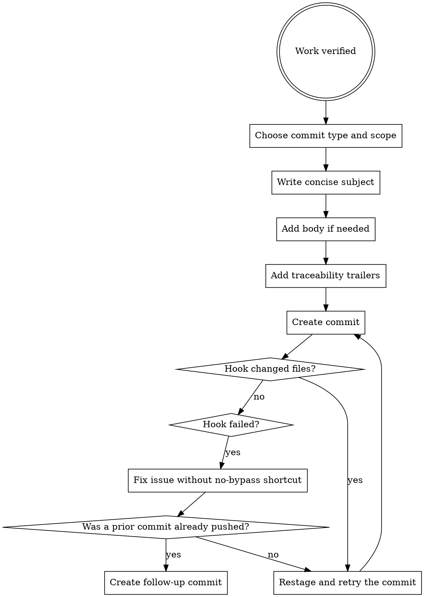

# Commits

Commits should describe the change clearly, reflect the real scope, and preserve traceability to the requirement, plan, and task.

Hook-aware commit flow matters as much as message quality: when hooks modify files, restage those changes and retry the commit; when hooks fail, fix the underlying issue instead of bypassing it.

## When To Use

- after a verified unit of work is complete
- when task-level progress should be recorded clearly
- when conventional commit structure and traceability matter

## Workflow

## Rules

- use conventional commit types
- keep the subject imperative and concise
- match scope to the actual module or concern
- include requirement, plan, and task IDs when the commit is part of tracked work
- if a hook writes files, restage them and retry the commit
- if a hook fails, fix the issue and do not use a no-bypass shortcut
- once prior history is pushed, do not amend it; create a follow-up commit instead

## Hook Failures And History Discipline

- if the first commit attempt is blocked and no commit exists yet, restage any hook-written files and retry the commit after fixing the issue
- if a hook keeps failing, treat that as a real blocker rather than reaching for `--no-verify`
- if a prior commit already exists and was pushed, keep pushed history stable: do not amend it; create a follow-up commit after fixing and restaging
- only consider amend while the earlier commit is still local and you are not rewriting pushed history

## Red Flags

Stop if:

- the message describes what changed but not the real intent
- the commit scope is broader than the actual change
- trailers are missing from tracked work
- verification has not happened yet
- you are tempted to use `--no-verify` for convenience
- a hook changed files and you are about to skip restaging them
- a prior commit was already pushed and you are still treating amend as a live option

## Companion Files

- `references/conventional-commit-guide.md`
- `commit-message-template.md`
