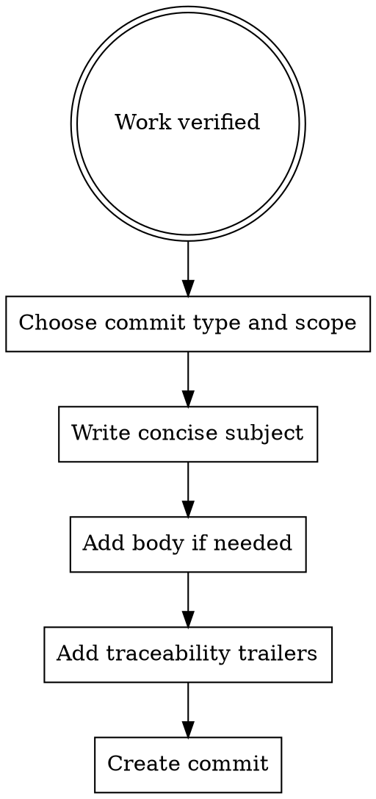

# Commits

Commits should describe the change clearly, reflect the real scope, and preserve traceability to the requirement, plan, and task.

## When To Use

- after a verified unit of work is complete
- when task-level progress should be recorded clearly
- when conventional commit structure and traceability matter

## Workflow

## Rules

- use conventional commit types
- keep the subject imperative and concise
- match scope to the actual module or concern
- include requirement, plan, and task IDs when the commit is part of tracked work
- do not bypass commit hooks casually

## Red Flags

Stop if:

- the message describes what changed but not the real intent
- the commit scope is broader than the actual change
- trailers are missing from tracked work
- verification has not happened yet
- you are tempted to use `--no-verify` for convenience

## Companion Files

- `references/conventional-commit-guide.md`
- `commit-message-template.md`
