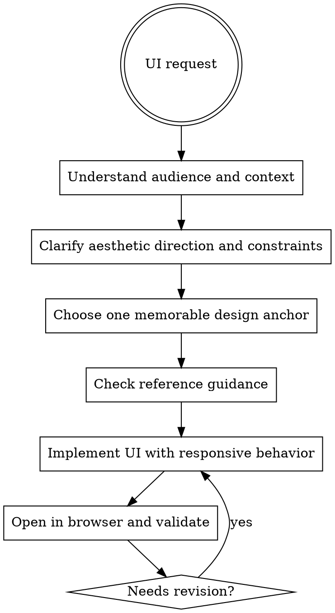

# Design

UI work needs a point of view. Do not produce a default, interchangeable layout and call it design.

## Hard Gate

Before building UI, lock the direction first. Do not jump straight into component code while the audience, visual direction, and constraints are still vague.

## When To Use

- new pages
- visual redesigns
- component systems or dashboards
- interaction-heavy UI changes

Do not use this for backend logic or pure data-pipeline work.

## Workflow

## Direction Lock

Before implementation, establish:

- who uses this and in what context
- the visual direction in specific terms
- the one thing the user should remember
- hard constraints: platform, responsiveness, accessibility, performance

"Clean and modern" is not a direction.

## Visual Guidance

- typography should carry personality, not disappear into defaults
- color should feel like a system, not random hex choices
- motion should emphasize important transitions, not decorate everything
- layout should reflect the content density and product intent

## Implementation Rules

- use semantic HTML
- design responsively from the start
- maintain accessible contrast and keyboard behavior
- keep the implementation complexity proportional to the design ambition
- preserve the product's existing design language if one already exists

## Validation

Open the result in a browser before claiming it is done.

If it only looks correct in code, it is not finished.

## Red Flags

Stop if the UI still feels like:

- a generic template
- a design with no clear visual anchor
- a desktop-only composition crammed onto mobile
- a set of effects with no hierarchy
- a page you have not actually viewed in the browser

## Companion Files

- `references/design-reference.md`
