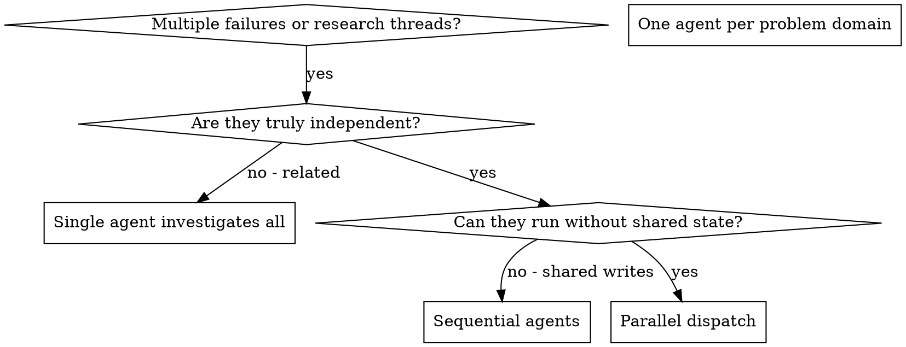

# Dispatching Parallel Agents

## Overview

You delegate tasks to specialized agents with isolated context. By precisely crafting their instructions and context, you ensure they stay focused and succeed at their task. Subagents should never inherit your session's history — you construct exactly what each one needs. This also preserves your own context for coordination work.

Parallelism is only useful when tasks are genuinely independent. Split work so each runtime agent has a narrow goal, a clear boundary, and no write conflict.

**Core principle:** Dispatch one agent per independent problem domain. Let them work concurrently.

## When To Use



**Use when:**

- 3+ test files failing with different root causes
- multiple subsystems broken independently
- multiple research questions that can be answered in isolation
- each problem can be understood without context from the others
- no shared state between investigations

**Do not use when:**

- failures are related (fixing one might fix the rest)
- you need to understand full system state first
- agents would interfere with each other (same files, same resources, ordering matters)

## Workflow

1. Confirm the work can be parallelized using `references/parallel-safety-checklist.md`.
2. Define one outcome per runtime agent.
3. Use `dispatch-template.md` so every agent gets scope, inputs, constraints, and output format.
4. Launch agents only after shared-state risks are removed.
5. Read each returned summary; check for overlapping writes, contradictory conclusions, and missing evidence.
6. Merge results after all agents finish, then resolve any contradictions centrally.
7. Run final integration verification (`agentic verify all` or the relevant scoped command) after results are combined.

## The Pattern

### 1. Identify independent domains

Group failures or questions by what is broken or being investigated:

- File A tests: tool approval flow
- File B tests: batch completion behavior
- File C tests: abort functionality

Each domain is independent — fixing tool approval does not affect abort tests.

### 2. Create focused agent tasks

Each agent gets:

- **Specific scope** — one test file, one subsystem, one research question
- **Clear goal** — make these tests pass, answer this question, produce this artifact
- **Constraints** — forbidden overlap with other agents; do not touch other code
- **Expected output** — what summary, format, and evidence the controller will integrate

### 3. Dispatch in parallel

In Claude Code or another harness with subagents:

```text
Task("Fix agent-tool-abort.test.ts failures")
Task("Fix batch-completion-behavior.test.ts failures")
Task("Fix tool-approval-race-conditions.test.ts failures")
// All three run concurrently
```

In IM with persona subagents (OpenCode), prefer named personas where the work matches a role: `@coder` for bounded fixes, `@security` for security questions, `@qa` for test-strategy review, `@docs` for documentation gaps.

### 4. Review and integrate

When agents return:

- read each summary
- verify fixes do not conflict
- run the full test suite (`bun test` or the scoped equivalent)
- integrate all changes
- spot-check — agents can make systematic errors

## Focused Prompt Structure

Each parallel prompt should include:

- the single independent problem domain owned by that agent
- exact files, inputs, and constraints
- forbidden overlap with other agents
- verification or evidence the agent must return
- expected output format the controller can integrate safely

Example:

```text
Fix the 3 failing tests in src/agents/agent-tool-abort.test.ts:

1. "should abort tool with partial output capture" - expects 'interrupted at' in message
2. "should handle mixed completed and aborted tools" - fast tool aborted instead of completed
3. "should properly track pendingToolCount" - expects 3 results but gets 0

These look like timing/race conditions. Your task:

1. Read the test file and understand what each test verifies.
2. Identify the root cause — timing or actual bug?
3. Fix by:
   - replacing arbitrary timeouts with event-based waiting
   - fixing bugs in the abort implementation if found
   - adjusting test expectations only if the tested behavior intentionally changed

Do NOT just increase timeouts. Find the real issue. Do NOT touch any file outside
the test file and its direct dependencies under src/agents/abort/.

Return: summary of root cause and changes, plus the verification command you ran.
```

## Common Mistakes

| Bad | Good |
|---|---|
| "Fix all the tests" | "Fix agent-tool-abort.test.ts" — focused scope |
| "Fix the race condition" — no context | Paste the error messages and test names |
| No constraints — agent might refactor everything | "Do NOT change production code" or "fix tests only" |
| "Fix it" — you do not know what changed | "Return summary of root cause and changes" |

## Red Flags

Stop and reconsider if any of these apply:

- parallelizing tasks that write the same files
- dispatching before the dependency order is clear
- giving agents overlapping ownership
- treating speed as more important than coordination safety
- combining parallel results without checking for conflicts
- skipping final integration verification
- using parallel dispatch as a shortcut around `systematic-debugging` ("just have three agents try things")

## Verification

After agents return:

1. Review each summary — understand what changed.
2. Check for conflicts — did any two agents edit the same file or symbol?
3. Run the full test suite — verify all fixes work together.
4. Run `agentic verify all` (or the appropriate scoped command) before claiming completion.
5. Spot-check — read at least one diff per agent.

## Key Benefits

- **Parallelization** — multiple investigations happen simultaneously
- **Focus** — each agent has narrow scope, less context to track
- **Independence** — agents do not interfere with each other
- **Context preservation** — your session stays free for coordination

## Companion Files

- `references/parallel-safety-checklist.md`
- `dispatch-template.md`
