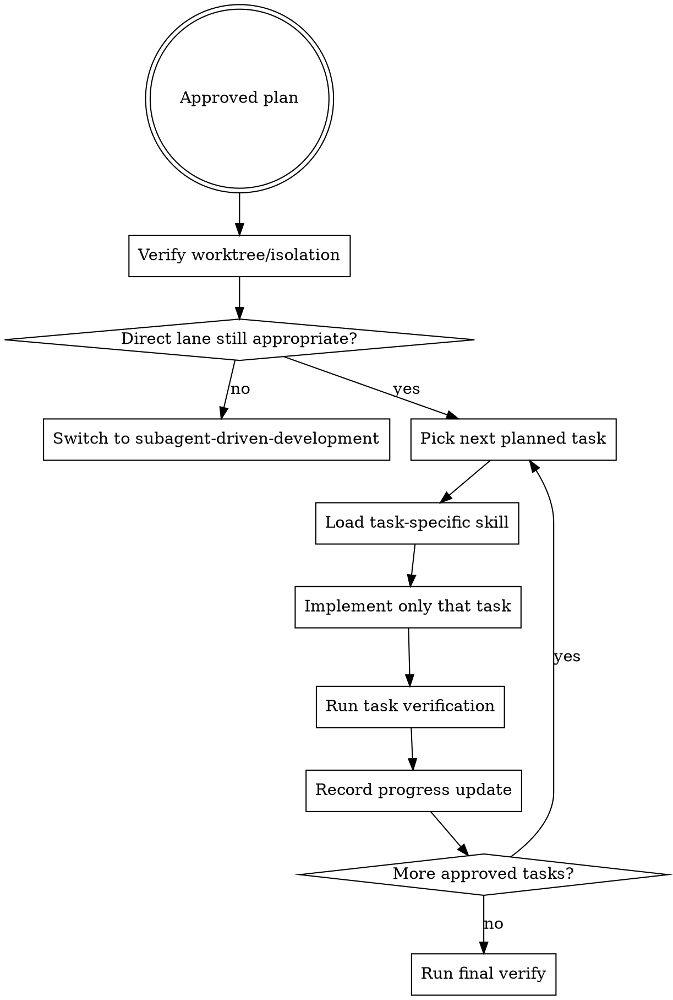

# Executing Plans

Execute an approved plan in order, keep scope tight, and keep verification current. This is the direct-execution lane for work that is already planned and narrow enough to stay in one implementation session.

## When To Use

- the plan is approved
- task order is already defined
- the work is small enough to stay inline instead of using `subagent-driven-development`
- you still want explicit progress tracking and stop points between tasks

Do not use this to invent or rewrite the plan while implementing.

## Workflow

## Core Rules

1. Execute only approved tasks.
2. Before non-trivial coding, verify worktree/isolation and branch safety.
3. Work one task at a time.
4. Load the right implementation skill for the task itself, usually `tdd`.
5. Re-check whether direct execution is still safe after each task.
6. Run `agentic verify all` before claiming the plan is complete.

## Isolation Gate

Before any non-trivial coding in this direct lane:

- confirm the session is already in an isolated worktree, or use `@worktree` / `worktree` to create or verify one
- check that the current branch is not `main`/`master` unless the user explicitly approved working there
- name the workspace path, branch, and isolation evidence in the progress update
- stop on unverified isolation instead of assuming "this repo is probably safe"

Tiny read-only checks and truly trivial single-line edits may skip new worktree setup, but still state why isolation is unnecessary.

## Choosing The Lane

Prefer `executing-plans` when:

- one agent can keep the full task context safely
- review can happen after the direct lane finishes or at natural checkpoints
- task boundaries are clear and low-risk

Prefer `subagent-driven-development` when:

- you need fresh-worker isolation per task
- mandatory spec-then-quality review must happen after every task
- multiple independent planned task groups should fan out in parallel

## Task Loop

For each task:

- copy the exact task text into your working notes
- confirm allowed files and verification command
- implement only the planned outcome
- update task status before moving on

Do not silently combine adjacent tasks just because they touch nearby code.

## Progress Updates

Use `progress-update-template.md` after each task or blocker. Keep the update factual: what task moved, what verified, and what is next.

## Red Flags

Stop if you catch yourself thinking:

- "I can clean up the next task while I am here"
- "The plan is close enough; I will improvise"
- "I do not need to report progress until the end"
- "This direct lane quietly turned into a multi-lane implementation"
- "I can skip final verification because each task passed"
- "I can code on main/master because this is quick"
- "The worktree is probably isolated; I do not need to verify it"

Those are signals to pause, tighten scope, verify isolation, or switch to `subagent-driven-development`.

## Runtime Agent

- In OpenCode, `@coder` is the natural implementer for a bounded task inside this direct execution lane.

## Companion Files

- `references/execution-checklist.md`
- `progress-update-template.md`
