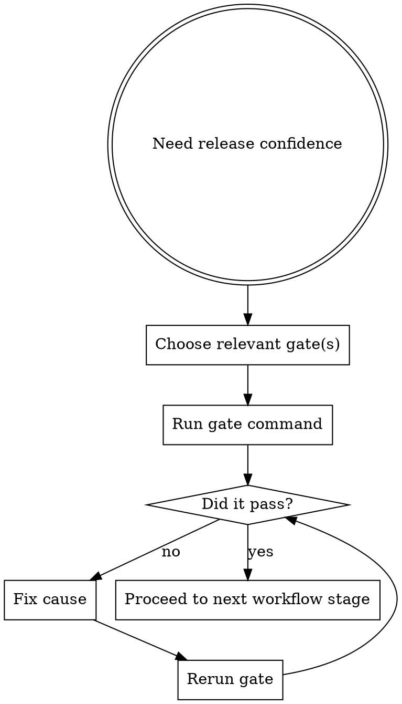

# Gates

Gates are workflow blockers, not suggestions. A failing gate means the work is not ready to proceed.

## When To Use

- before merge
- before PR creation
- after implementation changes
- when confirming plan/spec/quality state

## Workflow



## Gate Matrix

| Gate | Purpose |
|---|---|
| `coverage` | enforce minimum tested behavior |
| `typecheck` | enforce type safety |
| `security-secrets` | prevent literal secret leakage |
| `security-sast` | catch dangerous code patterns |
| `plan` | reject vague or placeholder-heavy plans |
| `spec` | Stage 1 compliance gate |
| `quality` | Stage 2 code quality gate |

## Common Commands

```sh
agentic gate all
agentic gate coverage
agentic gate typecheck
agentic gate security-secrets
agentic gate security-sast
agentic gate spec --ref <task-id>
agentic gate quality --ref <task-id>
agentic gate plan --planPath <path>
```

## Rules

- do not lower thresholds to escape a failure
- do not treat a partial pass as good enough
- fix the cause, not the symptom
- rerun the gate after the fix
- Do not proceed to PR, release, or completion claims while any required gate is failing.

## Review-Stage Notes

- `plan` blocks execution when the task breakdown is vague, placeholder-heavy, or not yet reviewable
- `spec` blocks quality review when requested behavior, scope, or verification coverage is still unclear
- `quality` blocks delivery when readability, maintainability, or repo-fit issues remain unresolved
- if one stage gate fails, report that blocker instead of skipping ahead to a later stage

## Red Flags

Stop if you catch yourself thinking:

- "this gate is too strict"
- "the failure is unrelated, I will ignore it"
- "I already ran something similar"
- "I can just suppress this once"

Those are release-risk shortcuts.

## Companion Files

- `references/gate-matrix.md`
- `hook-installation.md`
