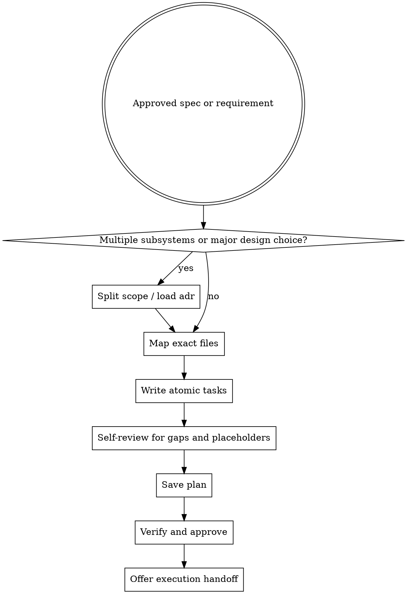

# Planning

Write plans that a fresh engineer can execute with minimal guesswork. Every task should be small, concrete, and verifiable.

## When To Use

- after a requirement or written spec is approved
- before implementation starts
- when work spans multiple files or multiple behaviors

## Workflow



## File Map First

Before writing tasks, decide:

- which files will be created
- which files will be modified
- which files will be deleted
- which tests prove the work

Do not decompose tasks before this map is stable.

## Task Rules

Every task must include:

- exact file paths
- one concrete outcome
- a runnable verification command
- an expected result
- an estimate of 2-5 minutes

Split anything larger.

## Good And Bad Tasks

Bad:

- "handle edge cases"
- "write tests"
- "refactor as needed"
- "fill in implementation"

Good:

- "Add failing test in `tests/gates.test.ts` proving coverage parser reads Bun text output"
- "Update `gates/coverage.ts` to parse the `All files` row and rerun `bun test tests/gates.test.ts`"

## Red Flags

Stop and rewrite if the plan contains:

- `TBD`, `TODO`, `FIXME`
- `...`, `etc.`, or implicit filler text
- commands that require interpretation
- tasks that bundle multiple outcomes
- references like "same as previous task"

## Self-Review Checklist

- [ ] Every task has exact paths
- [ ] Every task has a runnable verification command
- [ ] The approved spec maps to one or more tasks
- [ ] No placeholders remain
- [ ] No task exceeds 5 minutes
- [ ] Dependency order is clear

## Save Format

Save to `plans/PLN-xxx.json`.

Example artifacts:

- `skills/plan/examples/example-plan.json` shows a small linear plan
- `skills/plan/examples/example-parallel-plan.json` shows grouped tasks with parallel lanes

```json
{
  "id": "PLN-xxx",
  "requirementId": "REQ-xxx",
  "title": "Plan title",
  "tasks": [
    {
      "id": "TSK-001",
      "title": "Add failing coverage parser test",
      "description": "Create a gate test proving Bun text coverage output is parsed from the All files row.",
      "filePaths": ["tests/gates.test.ts", "gates/coverage.ts"],
      "verificationCommand": "bun test tests/gates.test.ts",
      "expectedOutput": "pass",
      "estimatedMinutes": 4,
      "status": "pending"
    }
  ]
}
```

## Verify And Approve

```sh
agentic plan verify --id PLN-xxx
agentic plan approve --id PLN-xxx --by <approver>
```

Only approved plans should be executed.

## Execution Handoff

After saving and approving the plan, choose the execution mode deliberately:

- `executing-plans` for direct inline execution of a small approved plan in the current session
- `subagent-driven-development` for fresh-worker task execution with review gates
- direct implementation workflow only if the work is truly narrow enough to stay inline

If the plan contains independent lanes, say so explicitly and group the tasks. If tasks share setup, files, or review dependencies, keep them in one group instead of pretending they are parallel.

## Runtime Agent

- In OpenCode, prefer `@planner` when the work is pure task decomposition.

## Companion Files

- `plan-document-reviewer-prompt.md`
- `references/plan-checklist.md`
