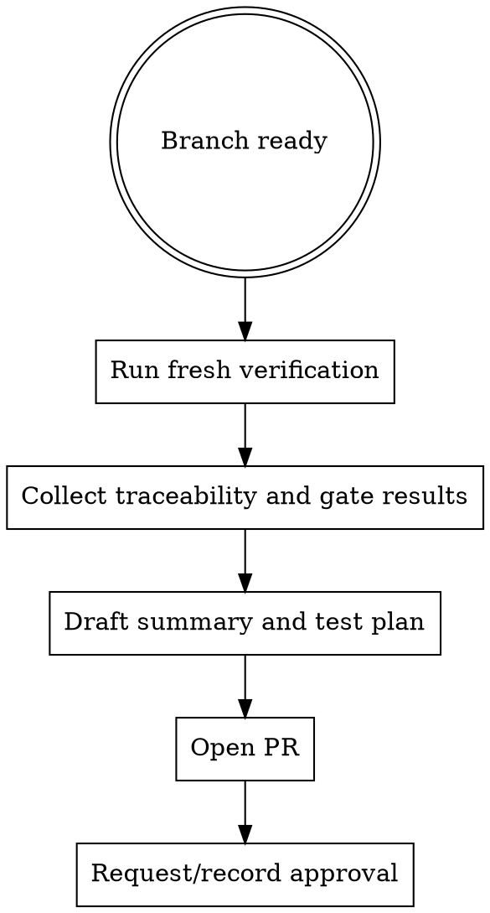

# Pull Requests

Open a PR only after the branch is verified and the work is review-ready.

## When To Use

- all planned work for the branch is complete
- the delivery unit or grouped tasks for that branch are complete
- verification passed
- review approvals and traceability are ready to summarize

## Workflow

## Required Before Opening

- fresh `agentic verify all`
- traceability from requirement to plan to tasks
- summary that explains why the change exists
- test plan or validation notes reviewers can follow

## PR Body Requirements

- concise summary
- traceability block
- gate results
- test plan

Use the companion template rather than improvising.

## Red Flags

Stop if:

- verification is stale or missing
- the PR body cannot explain why the work exists
- traceability IDs are missing
- reviewers would need to reverse-engineer how to validate the change

## Companion Files

- `references/pr-checklist.md`
- `pr-body-template.md`

## Runtime Agent

- In OpenCode, prefer `@release` when the task is preparing a review-ready PR summary and gate evidence.
