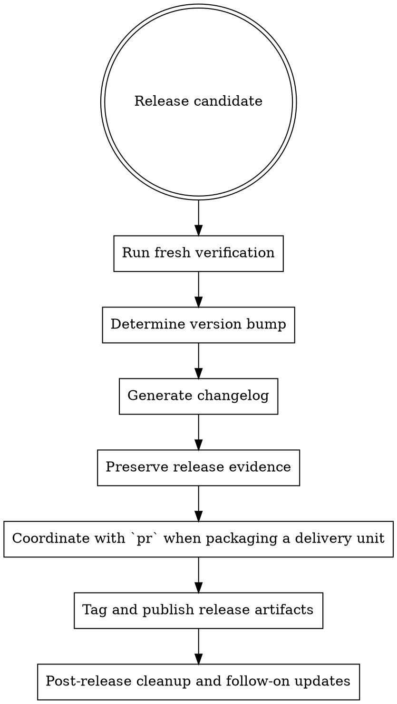

# Release

Release work is the final packaging step after code, reviews, and verification are already in good shape.

## When To Use

- a branch or merged set of changes is ready to ship
- verification and approval are complete
- versioning and changelog decisions must be made
- release readiness, versioning/changelog/tag/publish decisions must be packaged clearly
- delivery units or grouped tasks need release packaging; coordinate with `pr` only when packaging a delivery unit that also needs PR creation or a review-readiness body

## Workflow

## Required Steps

1. run fresh verification
2. determine release readiness from current gate, approval, and traceability evidence
3. determine the semver bump from the actual change history
4. generate the changelog with traceability where possible
5. preserve release evidence before cleanup so the verification, changelog, version intent, and release decision remain available
6. coordinate with `pr` only when packaging a delivery unit or grouped tasks that also need PR creation or a review-readiness body
7. tag and publish using the agreed release process
8. for post-release or follow-on work, check merged PRs and clean stale local branches/worktrees safely; safe preflight only when already-merged worktrees are being cleaned separately
9. use the cleanup order explicitly when branches are already merged: verify no dirty worktree, remove the worktree, delete the merged local branch, and keep optional remote branch deletion last; for multiple merged worktrees, preview candidates with `agentic worktree cleanup-merged --json` before `--apply`
10. update follow-up records like changelog or requirement status

## Rules

- do not release on stale verification evidence
- do not guess the version bump from memory
- do not skip changelog clarity just because the diff is small
- do not tag until the release notes and version intent are understood
- keep grouped delivery units together when coordinating release packaging with `pr`
- do not delete a remote branch as part of cleanup unless that remote deletion was explicitly requested

## Red Flags

Stop if:

- the version bump is being guessed
- verification is not fresh
- the changelog cannot explain the release clearly
- post-release cleanup is undefined

## Companion Files

- `references/semver-guide.md`
- `changelog-template.md`

## Runtime Agent

- In OpenCode, prefer `@release` for release-readiness, versioning/changelog/tag/publish work, and release evidence.
- Use the `pr` skill for PR creation and the review-readiness body; `@release` may coordinate with `pr` when packaging a delivery unit, but it is not the sole owner of `gh PR` creation.
