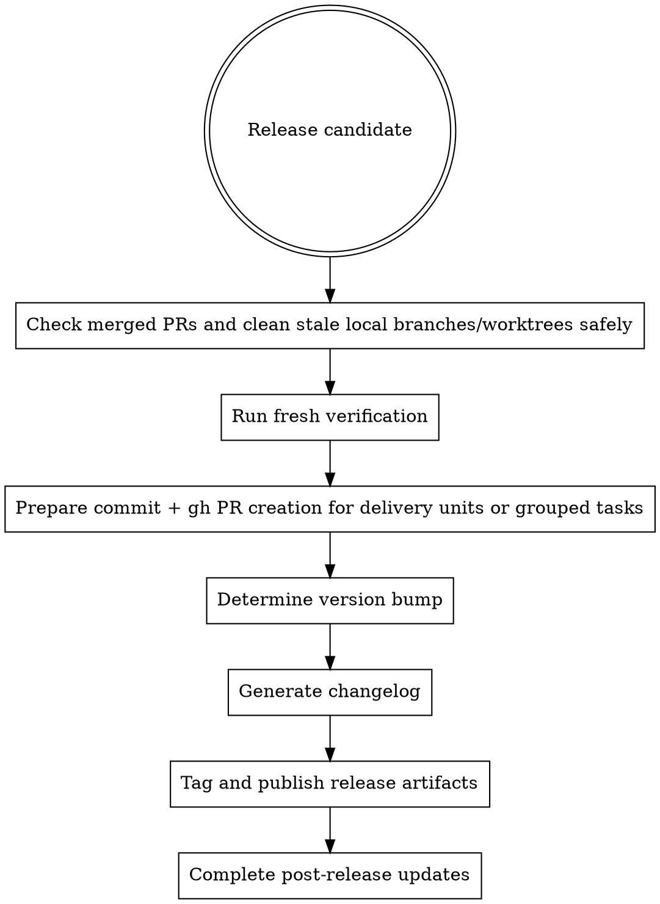

# Release

Release work is the final packaging step after code, reviews, and verification are already in good shape.

## When To Use

- a branch or merged set of changes is ready to ship
- verification and approval are complete
- versioning and changelog decisions must be made
- a delivery unit or grouped tasks are ready for commit + gh PR creation

## Workflow

## Required Steps

1. run fresh verification
2. for follow-on work, check merged PRs and clean stale local branches/worktrees safely
3. own commit + gh PR creation for delivery units or grouped tasks when requested
4. determine the semver bump from the actual change history
5. generate the changelog with traceability where possible
6. tag and publish using the agreed release process
7. update follow-up records like changelog or requirement status

## Rules

- do not release on stale verification evidence
- do not guess the version bump from memory
- do not skip changelog clarity just because the diff is small
- do not tag until the release notes and version intent are understood
- keep grouped delivery units together when preparing commit + gh PR creation

## Red Flags

Stop if:

- the version bump is being guessed
- verification is not fresh
- the changelog cannot explain the release clearly
- post-release cleanup is undefined

## Companion Files

- `references/semver-guide.md`
- `changelog-template.md`

## Runtime Agent

- In OpenCode, prefer `@release` for release-readiness and changelog work.
