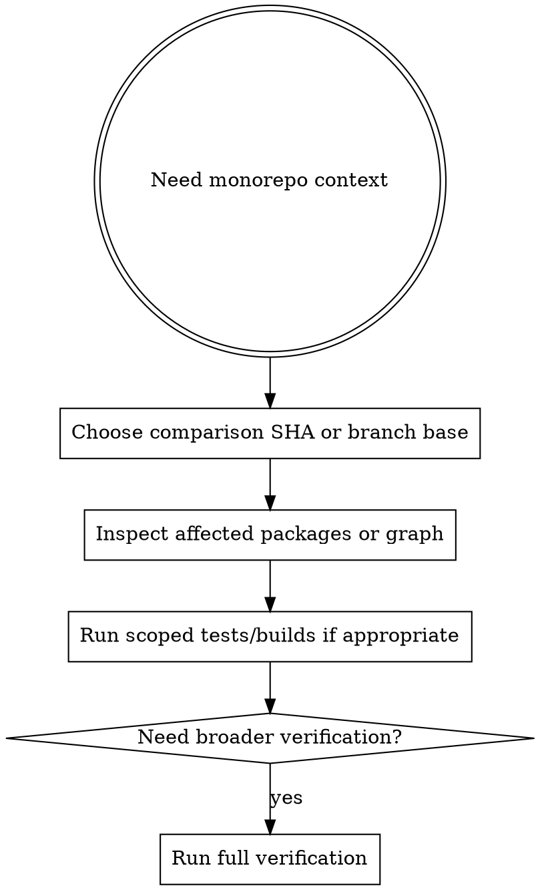

# Repo

Use repo-aware commands when the codebase has workspace relationships that make full-repo guesses too expensive or too noisy.

## When To Use

- monorepo impact analysis
- affected-package discovery
- scoped test or build runs
- dependency graph inspection before refactors

## Workflow



## Common Commands

```sh
agentic repo graph
agentic repo affected --since <sha>
agentic repo test --since <sha>
agentic repo build --since <sha>
```

## Rules

- choose the correct comparison point before trusting affected results
- inspect affected packages before assuming scoped runs are enough
- use full verification when the impact is broad or the graph is uncertain
- do not guess monorepo blast radius from filenames alone

## Red Flags

Stop if:

- you do not know the correct merge base or comparison SHA
- the workspace graph looks incomplete or surprising
- scoped results are being used to avoid broader verification without justification
- you are assuming transitive impact without checking the graph

## Companion Files

- `references/monorepo-assumptions.md`
- `impact-checklist.md`

## Runtime Agent

- In OpenCode, prefer `@planner` when repo graph analysis is driving task decomposition or scoped execution planning.
