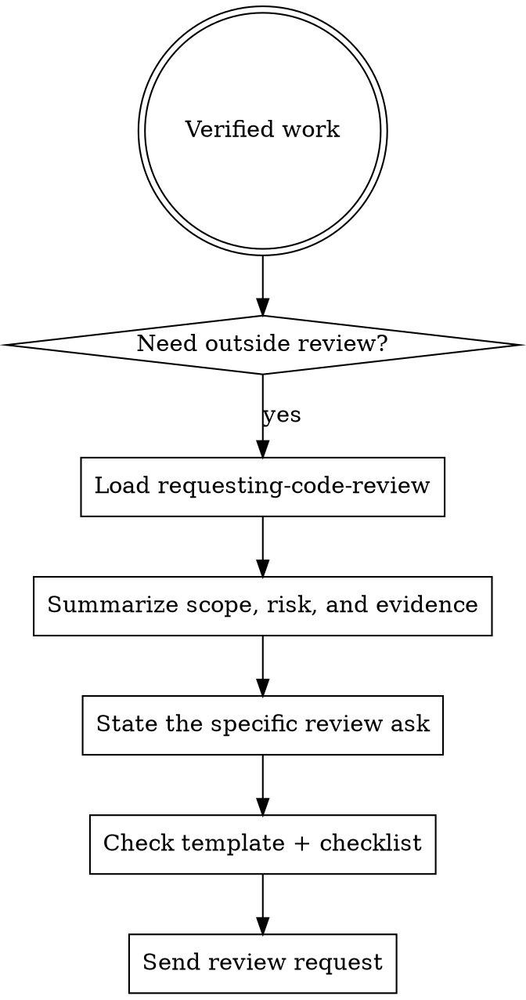

# Requesting Code Review

## Overview

Good review requests reduce reviewer thrash. Ask with scope, intent, evidence, and the specific kind of feedback you want. Dispatch a reviewer with precisely crafted context — never your session's history — so they focus on the work product, not your thought process.

**Core principle:** Review early, review often, ask precisely.

If a runtime agent is preparing the delivery lane, `@release` is the natural owner for packaging the review ask, but the controller still owns accuracy and scope.

## When To Request Review

**Mandatory:**

- after each task in `subagent-driven-development`
- after completing a major feature
- before merging to `main`

**Optional but valuable:**

- when stuck (a fresh perspective often unblocks)
- before a large refactor (baseline check)
- after fixing a complex bug

## Workflow



1. Confirm the work is ready for review, not still mid-debug or mid-implementation. Run `agentic verify all` first.
2. Get the base and head SHAs:

   ```sh
   BASE_SHA=$(git rev-parse HEAD~1)   # or origin/main
   HEAD_SHA=$(git rev-parse HEAD)
   ```

3. Summarize what changed, why it changed, and where reviewers should focus.
4. Include verification evidence, known risks, and any intentional follow-ups.
5. Make the ask explicit: correctness, architecture, risk, UX, security, or merge readiness.
6. Use `review-request-template.md`, then scan `references/review-request-checklist.md` before sending.

## What To Give The Reviewer

Every review request should include:

- **Description** — brief summary of what was built (1-3 sentences, no marketing voice)
- **Spec or requirements** — link to the plan, issue, or PR description that defines correct behavior
- **Base and head SHAs** — `BASE_SHA` and `HEAD_SHA`
- **Verification evidence** — `agentic verify all` output, targeted test commands, manual smoke evidence
- **Known risks and tradeoffs** — anything the reviewer would otherwise have to rediscover
- **Intentional follow-ups** — work explicitly deferred, with reason
- **Specific ask** — what kind of feedback you need (correctness, architecture, security, UX, merge readiness)

Do not make the reviewer rediscover the change from the diff alone.

## Acting On Feedback

- **Critical issues** — fix immediately, block merge until resolved
- **Important issues** — fix before proceeding to next task
- **Minor issues** — note for later, but do not silently drop them
- **Push back when the reviewer is wrong** — with technical reasoning, code, or tests that prove the existing approach. Receiving disagreement is normal; the `receiving-code-review` skill covers how to respond.

## Severity Classifications

| Severity | Action | Examples |
|---|---|---|
| **Critical** | Fix now, block merge | Data loss, security hole, broken contract |
| **Important** | Fix before next task | Wrong behavior, missing test, leaky abstraction |
| **Minor** | Track for follow-up | Naming, style, optional refactor |

If the reviewer mixes severities, ask for clarification rather than guessing.

## Example Review Request

```text
Description: Added verifyIndex() and repairIndex() with 4 issue types.
Spec: Task 2 from PLN-deployment.md
Base SHA: a7981ec
Head SHA: 3df7661

Verification:
- `agentic verify all` passed: coverage 82%, typecheck clean, tests 91/91 pass
- targeted run: `bun test src/index/verify.test.ts` — 12/12 pass

Known risks:
- Repair path is best-effort; corrupted index returns null, caller must handle.

Intentional follow-ups:
- Adding metrics/observability is deferred to a separate PR.

Ask:
- Is the repair API safe to call concurrently?
- Are the 4 issue types the right granularity, or should they merge?
- Anything missing from the test set that you would expect?
```

## Red Flags

Stop and reconsider if any of these apply:

- asking for review without naming the changed scope
- dumping a diff with no reviewer guidance
- claiming "ready for merge" without `agentic verify all` evidence
- hiding known risks, tradeoffs, or deferred work
- asking for "general thoughts" when the real ask is targeted
- skipping review because "it is simple" (the simple ones often hide the worst bugs)

## Integration With Workflows

- **Subagent-driven development** — request review after each task using the IM `@reviewer-spec` then `@reviewer-quality` chain; persist with `agentic gate spec --ref <task-id>` and `agentic gate quality --ref <task-id>`.
- **Executing-plans** — request review after each task or at natural checkpoints; apply feedback before continuing.
- **Ad-hoc work** — request review before merge or when stuck.

## Companion Files

- `references/review-request-checklist.md`
- `review-request-template.md`
