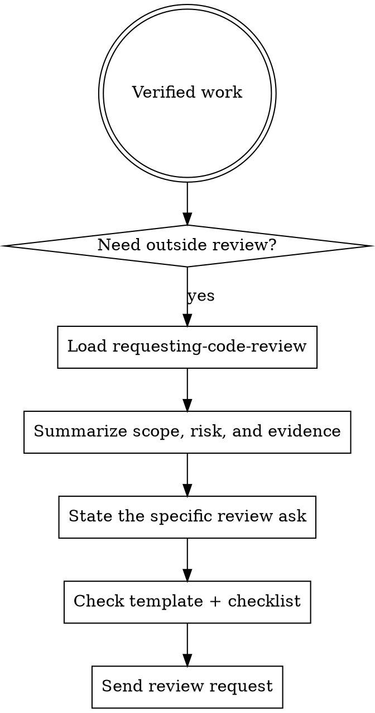

# Requesting Code Review

## Overview

Good review requests reduce reviewer thrash. Ask with scope, intent, evidence, and the specific kind of feedback you want.

If a runtime agent is preparing the delivery lane, `@release` is the natural owner for packaging the review ask, but the controller still owns accuracy and scope.

## Workflow

1. Confirm the work is ready for review, not still mid-debug or mid-implementation.
2. Summarize what changed, why it changed, and where reviewers should focus.
3. Include verification evidence, known risks, and any intentional follow-ups.
4. Make the ask explicit: correctness, architecture, risk, UX, security, or merge readiness.
5. Use `review-request-template.md`, then scan `references/review-request-checklist.md` before sending.

## Red Flags

- Asking for review without naming the changed scope
- Dumping a diff with no reviewer guidance
- Claiming "ready for merge" without verification evidence
- Hiding known risks, tradeoffs, or deferred work
- Asking for "general thoughts" when the real ask is targeted

## Companion Files

- `references/review-request-checklist.md`
- `review-request-template.md`
