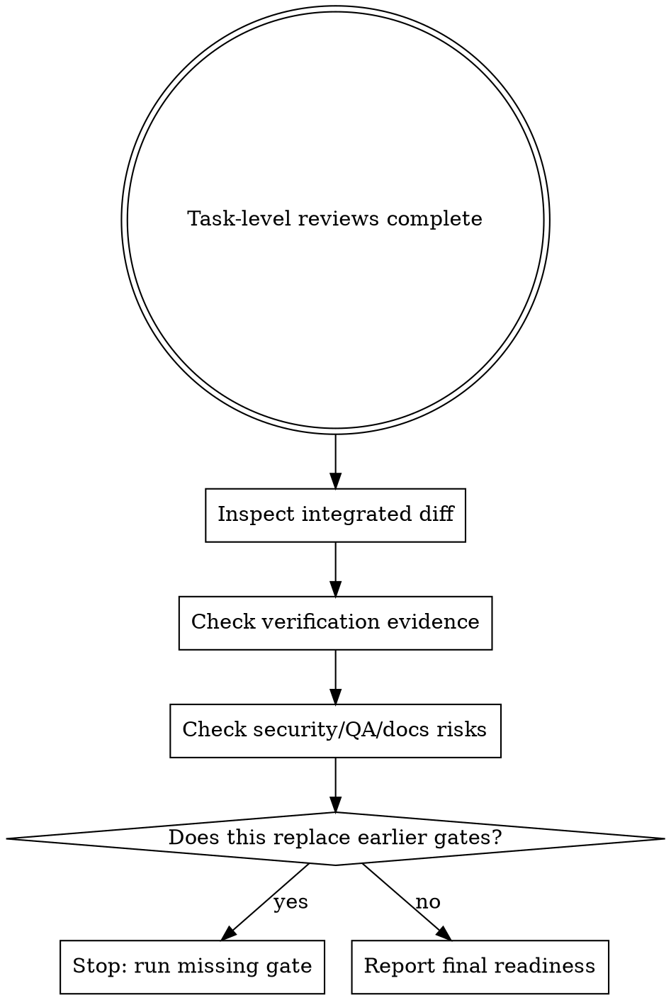

# Final Review

Final holistic production-readiness review checks whether the integrated change is ready to hand off. It runs after task-level reviews and before release/PR.

It does not replace `review-spec`, `review-quality`, `review-security`, the `@qa` agent, `gate`, or `verify`. QA is the `@qa` agent in this workflow, not a skill. It confirms their evidence still fits the integrated diff.

## Workflow

## What To Check

- integrated diff: does the combined change still make sense as one delivery unit?
- verification evidence: are focused tests, typecheck, and broader verification fresh and relevant?
- security risks: auth, input handling, secrets, persistence, permissions, or unsafe defaults
- QA risks: missing edge-case coverage, untested integration paths, migration/backward-compatibility gaps
- documentation risks: behavior, commands, config, or operational changes not explained
- release/PR readiness: traceability, known concerns, and rollback/follow-up notes are explicit

Use `references/final-review-checklist.md` and report with `final-review-template.md`.

## Boundaries

- Do not re-run Stage 1 spec review as if task-level `review-spec` never happened.
- Do not re-run Stage 2 quality review as if task-level `review-quality` never happened.
- Do not approve when either prior gate is missing, stale, or contradicted by the integrated diff.
- Escalate to `review-security`, `@qa`, or docs/release agents when the final pass finds a specialized risk.

## Red Flags

- treating final review as a shortcut around `review-spec` or `review-quality`
- looking only at the latest commit instead of the integrated diff
- accepting stale verification evidence
- ignoring security, QA, or documentation risks because task-level reviews passed
- saying ready for PR/release without naming concerns and evidence

## Runtime Agent

- In OpenCode, prefer `@reviewer-final` for this read-only final holistic readiness review.

## Companion Files

- `references/final-review-checklist.md`
- `final-review-template.md`
