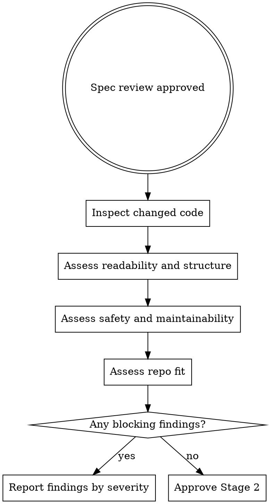

# Quality Review

This is Stage 2 review. It assumes the task is already spec-correct and focuses on how the code is built.

## When To Use

- after Stage 1 spec review passes
- when checking readability, maintainability, and repo fit
- before finalizing a reviewed task

## Workflow



## What To Check

- names are clear and aligned with behavior
- control flow is understandable without heroic effort
- code is sensibly scoped and not over-abstracted
- duplication is reasonable
- debug leftovers and incidental complexity are removed
- changes follow established repo patterns

## What Not To Re-Do

- do not rerun Stage 1 in disguised form
- do not reject the code just because you would design it differently
- do not block on minor stylistic preferences

## Severity Model

- `CRITICAL`: severe correctness, security, or maintainability risk
- `HIGH`: likely bug or substantial maintenance problem
- `MEDIUM`: worthwhile issue that should usually be fixed now
- `LOW`: advisory improvement or follow-up note

## Red Flags

Stop and raise findings if you see:

- names that hide intent
- deeply tangled control flow
- obvious duplication with no reason
- debug code left in production paths
- abstractions introduced without payoff
- patterns that fight the existing codebase unnecessarily

## Output

On success:

```sh
agentic gate quality --ref <task-id>
```

On failure, report severity, location, and why the issue matters.

## Companion Files

- `references/quality-review-checklist.md`
- `review-severity-guide.md`

## Runtime Agent

- In OpenCode, prefer `@reviewer-quality` for this review stage.
