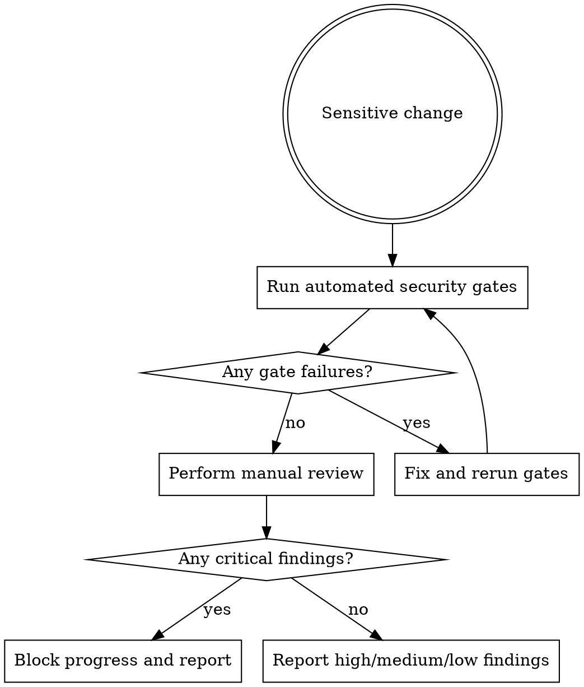

# Security Review

Run security review after implementation and before merge whenever the change touches sensitive behavior. Critical findings block progress.

## When To Use

- authentication or authorization
- user input handling
- API endpoints or request parsing
- secrets, tokens, or environment configuration
- crypto, randomness, or session handling
- file paths, shell commands, or database queries

## Workflow



## Step 1: Automated Checks

Run first:

```sh
agentic gate security-secrets
agentic gate security-sast
```

If either fails, stop and fix that before doing the rest of the review.

## Step 2: Manual Review

Check the change for:

- secret exposure in code, logs, or error messages
- weak or missing validation at system boundaries
- injection risk in SQL, shell, HTML, or path handling
- missing auth or broken authorization checks
- insecure randomness or crypto choices
- unsafe default behavior or misconfigured env handling

## Severity Model

- `CRITICAL`: exploitable vulnerability, data exposure, auth bypass, or severe integrity risk
- `HIGH`: likely security bug that must be fixed before merge
- `MEDIUM`: meaningful weakness that should be fixed now if in scope
- `LOW`: note for follow-up or hardening

Critical findings block progress. High findings normally block merge too.

## Reporting Rules

- be specific about file and line when possible
- explain why the issue matters
- distinguish confirmed risk from advisory hardening
- do not auto-fix in review mode

## Red Flags

Stop and look closer if you see:

- direct use of untrusted input in queries or commands
- trust based only on route-level checks
- token/session code using weak randomness
- env handling that assumes secrets always exist safely
- HTML rendering paths with untrusted content

## Companion Files

- `references/security-review-checklist.md`
- `references/common-findings.md`
- `review-report-template.md`

## Runtime Agent

- In OpenCode, prefer `@security` for this review stage.
