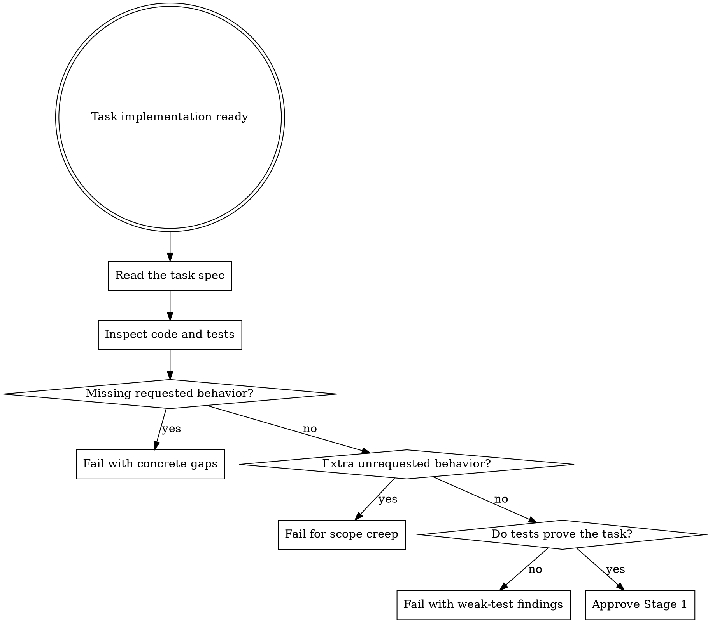

# Spec Review

This is Stage 1 review. Its job is to answer one question: does the implementation match the task, no more and no less?

## When To Use

- after implementation is complete for a task
- before code quality review starts
- when you need to confirm spec coverage and reject scope creep

## Workflow



## What To Check

- every requested behavior is implemented
- no requested behavior is missing or partial
- no extra behavior was added without approval
- tests verify the requested behavior, not internal details
- tests are strong enough to catch real regression of the task

## Review Rules

- this is read-only review
- do not suggest optional quality improvements here unless they affect spec compliance
- partial completion is still a failure
- passing tests do not override a mismatch with the task

## Red Flags

Stop and fail the review if you see:

- behavior not mentioned in the task
- tests coupled to private implementation details
- assertions so weak that the task could break while tests still pass
- a task only partially implemented but described as done

## Output

On success:

```sh
agentic gate spec --ref <task-id>
```

On failure, report:

- what is missing
- what is extra
- what test coverage is insufficient
- why each issue blocks Stage 2

## Companion Files

- `references/spec-review-checklist.md`
- `review-report-template.md`

## Runtime Agent

- In OpenCode, prefer `@reviewer-spec` for this review stage.
