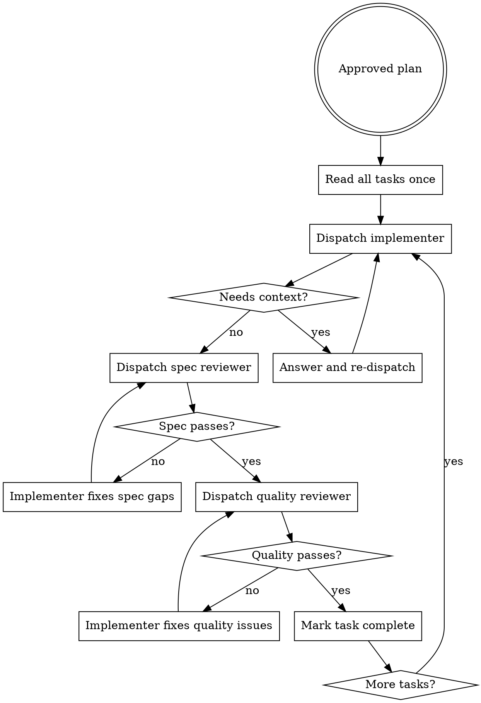

# Subagent-Driven Development

Execute an approved plan one task at a time with fresh task context and two mandatory review stages.

## When To Use

- The plan is approved
- Tasks are mostly independent
- You want tight control over context and review order

Do not use this before planning is complete.

## Core Rule

Every task follows this order:

1. implement
2. spec review
3. fix if needed
4. quality review
5. fix if needed
6. move to next task

Stage 2 never starts before Stage 1 passes.

## Controller Workflow



## Controller Responsibilities

- Read the plan once at the start
- Extract the full task text before dispatching
- Provide exact scope and file boundaries
- Tell implementers to use `tdd`
- let `@planner` mark independent planned task groups so they can fan out when safe
- independent planned task groups may fan out to multiple branches/worktrees/coders in parallel
- shared groups stay together until their shared work and delivery unit are complete
- Answer questions before work proceeds
- Record and respect review outcomes
- Handle implementer status explicitly instead of guessing
- Use real OpenCode subagents when available: `@coder`, `@reviewer-spec`, `@reviewer-quality`

## Companion Files

- `implementer-prompt.md`
- `spec-reviewer-prompt.md`
- `code-quality-reviewer-prompt.md`

## Preferred Runtime Agents

- `@coder` for implementation
- `@reviewer-spec` for Stage 1 review
- `@reviewer-quality` for Stage 2 review

## Persona Agent Map

Use the real OpenCode subagents according to role:

- `@po` for requirement clarification before planning
- `@planner` for task decomposition and execution planning
- `@worktree` for workspace isolation/setup before non-trivial coding
- `@architect` for architectural decisions or ADR-shaped questions
- `@coder` for bounded implementation work
- `@qa` for read-only test strategy and edge-case review
- `@security` for read-only security review
- `@reviewer-spec` for Stage 1 spec compliance
- `@reviewer-quality` for Stage 2 code quality review
- `@docs` for bounded documentation updates
- `@release` for PR/release readiness, changelog, and traceability

## What To Give The Implementer

Every dispatch should include:

- full task text copied from the plan
- where this task fits in the plan
- allowed files
- verification command
- explicit instruction to follow `tdd`

Do not make the subagent rediscover the task from the repo.

## Implementer Status

Implementers should report one of these statuses:

- `DONE`: task is complete and ready for Stage 1 review
- `DONE_WITH_CONCERNS`: task is complete, but concerns need reading before review
- `NEEDS_CONTEXT`: missing information must be provided before work can continue
- `BLOCKED`: the task cannot proceed without changing context, scope, or plan

Never ignore `NEEDS_CONTEXT` or `BLOCKED`. Change the conditions before redispatching.

## Stage 1: Spec Review

Check:

- all requested behavior is present
- nothing extra was built
- tests prove the task, not the implementation details

Persist with:

```sh
agentic gate spec --ref <task-id>
```

## Stage 2: Quality Review

Check:

- readability and naming
- simple control flow
- no avoidable duplication
- no obvious hardcoded values without reason
- no debug leftovers in production paths

Persist with:

```sh
agentic gate quality --ref <task-id>
```

## Red Flags

Never:

- start task 2 while task 1 reviews are unresolved
- run quality review before spec review passes
- make the subagent read the whole plan file if you can provide the exact task text
- ignore implementer questions
- treat reviewer findings as optional

## Escalation

Escalate when:

- the same stage fails repeatedly
- the plan is wrong or incomplete
- the task is not actually independent
- the fix would change architecture or requirement scope

Use `agentic audit trace --id <req-id>` to inspect the full chain when needed.

## Example Workflow

```text
Controller: Dispatch implementer with the exact task text, allowed files, and verification command.
Controller: In OpenCode, prefer `@coder` for this role.

Implementer: NEEDS_CONTEXT - should this update the existing JSON format or add a new one?

Controller: Update the existing JSON format only. Re-dispatching with that constraint.

Implementer: DONE - implementation complete, focused test passes.

Controller: Dispatch spec reviewer.
Controller: In OpenCode, prefer `@reviewer-spec` for this role.

Spec reviewer: Issues Found - added an extra CLI flag not requested.

Controller: Send findings back to the same implementer.

Implementer: DONE - removed the extra flag and reran tests.

Controller: Dispatch spec reviewer again, then quality reviewer only after spec passes.
Controller: In OpenCode, prefer `@reviewer-quality` only after Stage 1 passes.
```

## Extended Orchestration Pattern

For deeper in-chat orchestration, route work by role instead of asking one agent to do everything:

1. `@po` clarifies the requirement
2. `@architect` resolves major design choices if needed
3. `@planner` decomposes the approved design into tasks
4. `@worktree` verifies or creates isolated workspace state when needed
5. `@coder` executes one task at a time
6. `@reviewer-spec` and `@reviewer-quality` review each completed task
7. `@security` reviews risk-sensitive changes
8. `@qa` reviews test strategy gaps when useful
9. `@docs` updates documentation if behavior changed
10. `@release` prepares PR/release evidence and traceability
