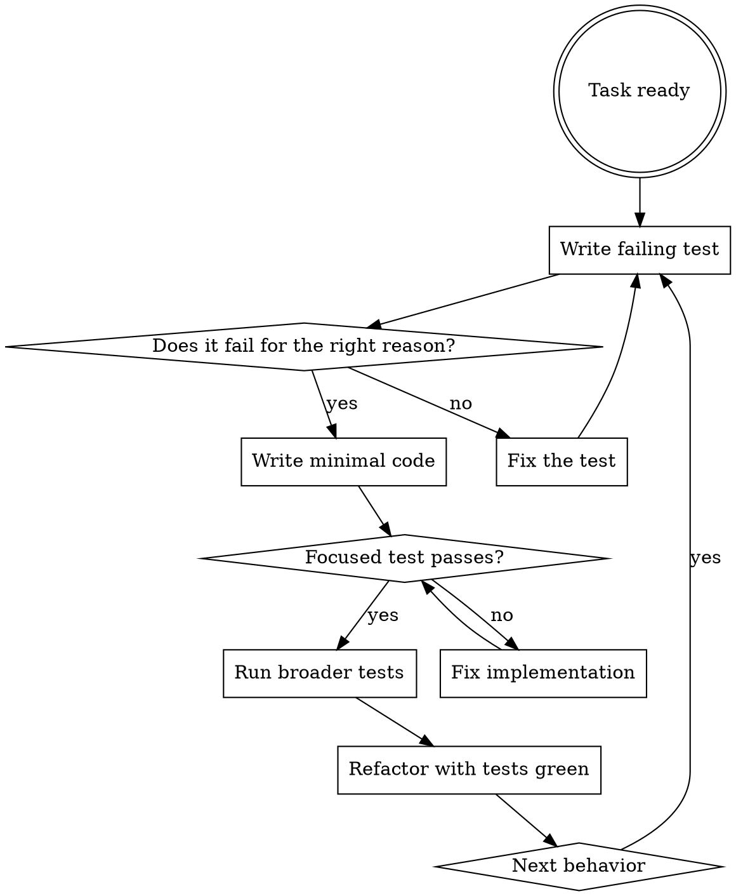

# Test-Driven Development

Write the test first. Watch it fail. Write minimal code to pass. If production code appears before the failing test, delete it and restart.

## Overview

If you did not watch the test fail, you do not know whether it proves the right thing.

**Violating the letter of the rules is violating the spirit of the rules.** TDD is the evidence that the behavior was missing before your change, not a ceremony to explain away after coding.

## When To Use

Always for:

- new features
- bug fixes
- refactors that preserve or change behavior
- any production code path where correctness matters

Ask before skipping for:

- throwaway prototypes
- generated code
- pure configuration changes

## The Iron Law

```text
NO PRODUCTION CODE WITHOUT A FAILING TEST FIRST
```

Write code before the test? Delete it. Start over.

No exceptions:

- do not keep it as reference
- do not adapt it while writing the test
- do not claim tests-after is the same thing
- delete means delete: remove the code, stop looking at it, and re-implement from the failing test

## RED-GREEN-REFACTOR Workflow



### RED — Write Failing Test

Write one minimal automated test for the next observable behavior. Name the behavior, call the public interface, and assert the required result. For a bug fix, RED is the regression test that reproduces the bug before the fix.

**Requirements:**

- one behavior per test
- clear name that describes the behavior
- real code (no mocks unless the boundary is external I/O)

### Verify RED — Watch It Fail

**Mandatory. Never skip.** Run the focused test:

```sh
bun test path/to/test.test.ts
```

Confirm:

- the test **fails** (not errors)
- the failure message is the one you expected
- the failure is because the behavior is missing (not a typo, import error, or setup mistake)

| Outcome | Action |
|---|---|
| Test passes immediately | You are testing existing behavior. Fix the test. |
| Test errors on setup | Fix the error and rerun until it fails for the right reason. |
| Test fails for the right reason | Proceed to GREEN. |

### GREEN — Minimal Code

Write the simplest code that makes the failing test pass. Do not add options, generalized helpers, cleanup, or nearby improvements that the test did not require.

### Verify GREEN — Watch It Pass

**Mandatory.** Run the focused test:

```sh
bun test path/to/test.test.ts
```

Confirm:

- the test **passes**
- other tests still pass
- output is pristine (no errors, no warnings, no debug leftovers)

| Outcome | Action |
|---|---|
| Test fails | Fix the **code**, not the test. |
| Other tests fail | Fix them before continuing. |
| Output noisy | Remove debug code before moving on. |

### REFACTOR — Clean Up While Green

Only refactor after GREEN. Improve names, remove duplication, or simplify shape without adding behavior. Run the focused tests after each refactor step. If a refactor breaks tests, get back to GREEN before changing anything else.

## Good And Bad Tests

Good:

```ts
test("rejects empty plan titles", () => {
  expect(() => createPlan({ title: "" })).toThrow("title");
});
```

Bad:

```ts
test("plan works", () => {
  expect(createPlan).toBeDefined();
});
```

Prefer one clear behavior over vague coverage.

## Why The Order Matters

- tests written after code often pass immediately and prove nothing
- tests-first forces you to validate the behavior was actually missing
- manual testing is not repeatable proof
- if a test passes immediately, it may be testing existing behavior, a mock, or the wrong assertion; fix the test and verify RED before writing production code
- RED and GREEN verification are mandatory: run the focused test, read the failure, then run it again after the minimal implementation
- manual testing is a useful exploration aid, but it is not the RED step; reject manual-test shortcuts because they leave no repeatable regression proof

## Example: Bug Fix Regression

Bug: duplicate task names are accepted.

**RED**

```ts
test("rejects duplicate task names", () => {
  const board = createBoard([{ name: "ship" }]);

  expect(() => board.addTask({ name: "ship" })).toThrow("duplicate task");
});
```

Focused failure to observe before coding:

```text
FAIL expected function to throw "duplicate task"
```

**GREEN**

```ts
addTask(task: Task) {
  if (this.tasks.some((existing) => existing.name === task.name)) {
    throw new Error("duplicate task");
  }
  this.tasks.push(task);
}
```

**REFACTOR**

Only after the regression test passes, extract a `hasTaskNamed` helper if it makes the code clearer. Do not add case-insensitive matching or cross-project uniqueness until a failing test requires it.

## Test Quality

| Quality | Good | Bad |
|---|---|---|
| **Minimal** | One thing. If you have to say "and" in the name, split it. | `test('validates email and domain and whitespace')` |
| **Clear name** | Name describes the behavior in plain language | `test('test1')`, `test('it works')` |
| **Shows intent** | Demonstrates the desired API | Obscures what the code should do |
| **Real code** | Calls public interface with real inputs | Verifies mock call counts instead of behavior |

## Why Order Matters

**"I'll write tests after to verify it works"**

Tests written after code pass immediately. Passing immediately proves nothing:

- might test the wrong thing
- might test implementation, not behavior
- might miss edge cases you forgot
- you never saw it catch the bug

Test-first forces you to see the test fail, proving it actually tests something.

**"I already manually tested all the edge cases"**

Manual testing is ad-hoc. You think you tested everything but:

- no record of what you tested
- cannot re-run when code changes
- easy to forget cases under pressure
- "it worked when I tried it" ≠ comprehensive

Automated tests are systematic. They run the same way every time.

**"Deleting X hours of work is wasteful"**

Sunk cost fallacy. The time is already gone. Your choice now:

- delete and rewrite with TDD (X more hours, high confidence)
- keep it and add tests after (30 minutes, low confidence, likely bugs)

The "waste" is keeping code you cannot trust. Working code without real tests is technical debt.

**"TDD is dogmatic; being pragmatic means adapting"**

TDD **is** pragmatic:

- finds bugs before commit (faster than debugging after)
- prevents regressions (tests catch breaks immediately)
- documents behavior (tests show how to use code)
- enables refactoring (change freely, tests catch breaks)

"Pragmatic" shortcuts mean debugging in production, which is slower.

**"Tests-after achieve the same goals — it's spirit, not ritual"**

No. Tests-after answer "what does this do?" Tests-first answer "what should this do?"

Tests-after are biased by your implementation. You test what you built, not what's required. You verify remembered edge cases, not discovered ones.

Tests-first force edge-case discovery before implementing. Tests-after verify you remembered everything (you did not).

30 minutes of tests-after ≠ TDD. You get coverage, lose proof the tests work.

## Rationalization Prevention

| Excuse | Reality |
|---|---|
| "Too simple to test" | Simple code breaks. The test takes 30 seconds. |
| "I will test after" | Tests-after are biased by the implementation and may pass immediately. |
| "Tests-after achieve the same goals" | Tests-after = "what does this do?" Tests-first = "what should this do?" |
| "Already manually tested" | Ad-hoc ≠ systematic. No record, cannot re-run. |
| "Deleting X hours is wasteful" | Sunk cost fallacy. Keeping unverified code is technical debt. |
| "Keep as reference, write tests first" | You will adapt it. That is testing after. Delete means delete. |
| "Need to explore first" | Fine — throw away the exploration, then start TDD. |
| "Test is hard = the test is wrong" | Hard to test usually = hard to use. Listen to the test. |
| "TDD will slow me down" | TDD is faster than debugging. Pragmatic = test-first. |
| "Manual test is faster" | Manual does not prove edge cases. You will re-test every change. |
| "Existing code has no tests" | You are improving it. Add tests for what you touch. |
| "The test passes immediately, so that's fine" | A test that passes immediately only proves the behavior already existed or the test is weak. |
| "The spirit matters more than the ritual" | Violating the letter of TDD removes the evidence TDD exists to provide. |
| "I am stuck on the test" | Stop and simplify the desired public API; ask for help before coding around the missing test. |

## Red Flags

Stop if you catch yourself thinking:

- "This is too small to test"
- "I already know the fix"
- "I will add tests after"
- "Deleting this code would waste time"
- "This one exception is fine"
- "The test passes immediately, but I can continue"
- "I can keep the implementation open while I write the test"

Those are TDD rationalizations.

## Rules

- one behavior per test whenever practical
- prefer behavior assertions over implementation-detail assertions
- avoid mocks unless the boundary is external I/O
- if the test passes immediately, fix the test before proceeding
- if production code was written before RED, delete it and start over with TDD

## When Stuck

| Problem | Move |
|---|---|
| You do not know how to test it | Write the wished-for public API in the test first, then ask whether that interface is right. |
| The test setup is huge | The design may be too coupled; simplify the interface or inject the external boundary. |
| The failure is not about the missing behavior | Fix the test until RED fails for the right reason. |
| You already wrote the fix | Delete the production code, stop looking at it, and start over with TDD. |
| A manual test seems faster | Use it only to learn; still write the automated regression before changing production code. |

## Companion Files

- `testing-anti-patterns.md`
- `regression-checklist.md`

## Completion

TDD proves the change incrementally. Broader workflow verification still happens later:

```sh
agentic verify all
```
