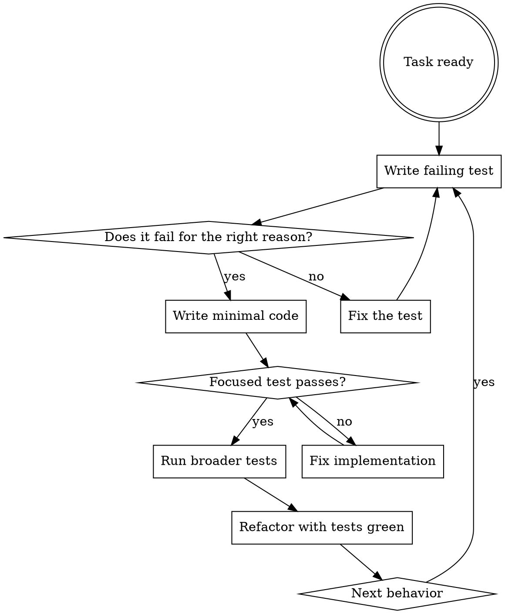

# Test-Driven Development

Write the test first. Watch it fail. Write minimal code to pass. If production code appears before the failing test, delete it and restart.

## Overview

If you did not watch the test fail, you do not know whether it proves the right thing.

## When To Use

Always for:

- new features
- bug fixes
- refactors that preserve or change behavior
- any production code path where correctness matters

Ask before skipping for:

- throwaway prototypes
- generated code
- pure configuration changes

## The Iron Law

```text
NO PRODUCTION CODE WITHOUT A FAILING TEST FIRST
```

Write code before the test? Delete it. Start over.

No exceptions:

- do not keep it as reference
- do not adapt it while writing the test
- do not claim tests-after is the same thing

## Workflow



## Good And Bad Tests

Good:

```ts
test("rejects empty plan titles", () => {
  expect(() => createPlan({ title: "" })).toThrow("title");
});
```

Bad:

```ts
test("plan works", () => {
  expect(createPlan).toBeDefined();
});
```

Prefer one clear behavior over vague coverage.

## Why The Order Matters

- tests written after code often pass immediately and prove nothing
- tests-first forces you to validate the behavior was actually missing
- manual testing is not repeatable proof

## Red Flags

Stop if you catch yourself thinking:

- "This is too small to test"
- "I already know the fix"
- "I will add tests after"
- "Deleting this code would waste time"
- "This one exception is fine"

Those are TDD rationalizations.

## Rules

- one behavior per test whenever practical
- prefer behavior assertions over implementation-detail assertions
- avoid mocks unless the boundary is external I/O
- if the test passes immediately, fix the test before proceeding

## Companion Files

- `testing-anti-patterns.md`
- `regression-checklist.md`

## Completion

TDD proves the change incrementally. Broader workflow verification still happens later:

```sh
agentic verify all
```
