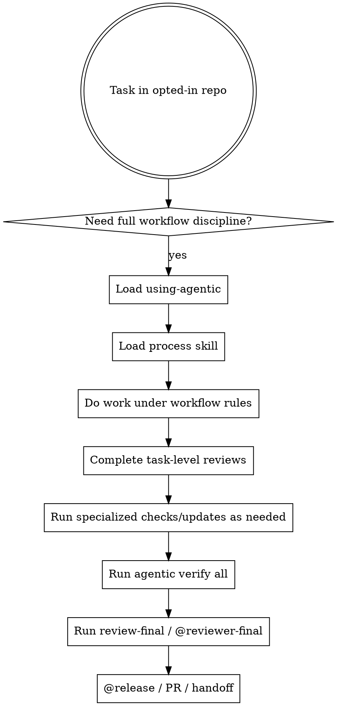

# Using Agentic

This is the entrypoint for the full Imitation Machine workflow. It should guide work only in repositories or sessions that explicitly opted into that workflow.

<SUBAGENT-STOP>
If you were dispatched to execute one bounded task with clear instructions, do not restart the whole workflow from here unless the controller told you to.
</SUBAGENT-STOP>

<EXTREMELY-IMPORTANT>
If you think there is even a 1% chance a workflow skill might apply to what you are doing, you ABSOLUTELY MUST invoke the skill before proceeding.

IF A SKILL APPLIES TO YOUR TASK, YOU DO NOT HAVE A CHOICE. YOU MUST USE IT.

This is not optional. You cannot rationalize your way out of this.
</EXTREMELY-IMPORTANT>

## Instruction Priority

1. User instructions and repo-local instructions
2. Active Imitation Machine skills
3. Default assistant behavior

If a repo or user explicitly wants a narrower workflow, follow that instead of expanding into the full process stack.

## When To Use

- the repository explicitly opts into Imitation Machine
- the task needs the full workflow discipline, not just an isolated skill
- planning, implementation, review, and verification all need to line up under the same system

Do not use this just because the plugin is globally installed.

## The Rule

If the repo explicitly opted in and a process skill might apply, load it before non-discovery work.

## Workflow



Preferred sequence:

Canonical final sequence:

1. implementation and task-level `review-spec` / `review-quality`
2. specialized checks/updates as needed: `review-security` / `@security`, `@qa`, `@docs`
3. fresh `agentic verify all`
4. `review-final` / `@reviewer-final`
5. `@release` / PR / handoff

## Skill Order

1. Process skills decide how to approach the task
2. Review and domain skills constrain the implementation
3. Release skills finalize delivery

## Process Skills

| Situation | Skill |
|---|---|
| New idea or under-specified behavior | `brainstorm` |
| Explicit adversarial clarification before commitment | `grill-me` |
| Requirements intake before issue slicing | `requirements-brief` |
| Approved intake needs vertical issue drafts | `issue-slicing` |
| Read-only discovery/orientation before planning, implementation, or code changes; no writes/no implementation | `zoom-out` |
| Read-only architecture candidate discovery for shallow/deep modules, seams, dependencies, tests, and handoffs; no writes/no implementation | `architecture-deepening` |
| Approved disposable prototype after read-only `zoom-out`; not a production implementation, not a TDD shortcut; hand off learning to production `plan`/`tdd` | `prototype` |
| Approved requirement needs executable tasks | `plan` |
| Approved plan should be executed directly in-session | `executing-plans` |
| Implementation or bug fix | `tdd` |
| Debugging a stubborn failure | `systematic-debugging` |
| Triaging issues on the project issue tracker | `triage` |
| Safe fanout of independent agent work | `dispatching-parallel-agents` |

Ambiguous prototype requests stay in `brainstorm` or read-only `zoom-out`; read-only prototype exploration stays in `zoom-out` until a disposable prototype is approved.

## Supporting Skills

| Situation | Skill |
|---|---|
| Multi-task execution loop | `subagent-driven-development` |
| Architecture decision | `adr` |
| Spec review | `review-spec` |
| Quality review | `review-quality` |
| Security review | `review-security` |
| Preparing a clear review request | `requesting-code-review` |
| Responding to review feedback | `receiving-code-review` |
| Final branch cleanup and handoff | `finishing-a-development-branch` |
| Final holistic production-readiness review | `review-final` |
| PR creation and review-readiness body | `pr` |
| Release readiness, versioning/changelog/tag/publish | `release` |
| Completion verification | `verify` |

Use `release` / `@release` to package release evidence and coordinate delivery-unit packaging. Use `pr` for the actual PR creation path and review-ready body; do not treat `@release` as the sole owner of `gh PR` creation.

## Red Flags

**Overreach** — stop if you catch yourself thinking:

- "The plugin is installed, so every task must use the full workflow"
- "This repo did not opt in, but I should force the workflow anyway"
- "A narrow review task still needs brainstorm and plan first"
- "I should expand the user's request instead of following it"

**Avoidance** — stop if you catch yourself rationalizing away a skill:

| Thought | Reality |
|---------|---------|
| "This is just a simple question" | Questions are tasks. Check for skills. |
| "I need more context first" | Skill check comes BEFORE clarifying questions. |
| "Let me explore the codebase first" | Skills tell you HOW to explore. Check first. |
| "I can do this one thing quickly" | Check BEFORE doing anything. |
| "This skill is overkill for this" | If a skill exists and might apply, use it. |
| "I remember how this skill works" | Skills evolve. Read current version. |
| "This doesn't count as implementation" | Any code change → `tdd`. Any plan execution → `executing-plans`. |
| "I'll verify after I finish" | `verify` gates completion. Not optional. |

## Completion Rule

In opted-in workflow sessions, do not claim completion or start final holistic review without fresh evidence from:

```sh
agentic verify all
```

## Agent Dispatch

**OpenCode** — use `@persona` syntax: `@po`, `@coder`, `@planner`, `@architect`, `@qa`, `@docs`, `@reviewer-spec`, `@reviewer-quality`, `@reviewer-final`, `@security`, `@release`, `@worktree`.

**Claude Code** — use the `Agent` tool with `subagent_type`. Agents are installed as `im-*` to avoid conflicts with existing agents:

| Role | subagent_type |
|---|---|
| Vague request, missing acceptance criteria, or unclear scope | `im-po` |
| Bounded TDD implementation | `im-coder` |
| Task decomposition | `im-planner` |
| Stage 1 spec review | `im-reviewer-spec` |
| Stage 2 quality review | `im-reviewer-quality` |
| Final holistic review | `im-reviewer-final` |
| Security review | `im-security` |
| Workspace isolation | `im-worktree` |

## Companion Files

- `references/opencode-tools.md`
- `references/project-context.md`
- `references/workflow-cheatsheet.md`
