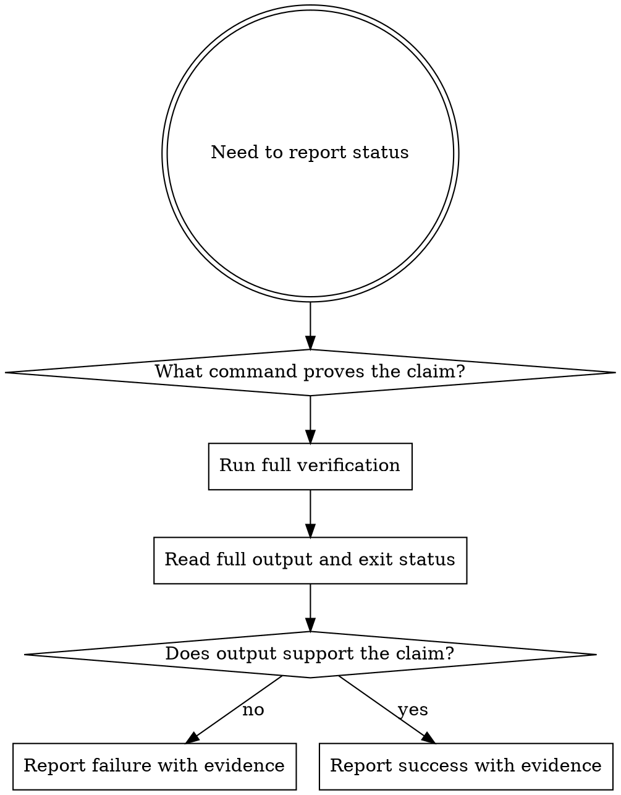

# Verification

Evidence comes before claims. If you have not run fresh verification for the claim you are making, you cannot honestly say the work passes.

## Overview

The rule is simple: identify the proof, run it now, read the output, then make the claim.

## Iron Law

```text
NO COMPLETION CLAIMS WITHOUT FRESH VERIFICATION EVIDENCE
```

## Required Command

```sh
agentic verify all
```

If `agentic` is unavailable:

```sh
bun "$AGENTIC_CLI_PATH" verify all
```

## What It Proves

`agentic verify all` runs:

1. `agentic gate all`
2. `bunx tsc --noEmit`
3. `bun test`

## Verification Loop



## Claim Matrix

| Claim | Requires | Not sufficient |
|---|---|---|
| Tests pass | fresh test output with 0 failures | old test run, "should pass" |
| Typecheck is clean | fresh typecheck output with 0 errors | linter pass, confidence |
| Ready for PR | fresh `agentic verify all` + review readiness | passing one gate |
| Bug is fixed | verification of the original symptom | code changed, assumed fixed |
| Work is complete | verification evidence matching the scope | implementation report alone |

## Red Flags

Stop if you are about to say:

- "done"
- "looks good"
- "should pass now"
- "ready for PR"
- "tests are green"
- "probably fixed"

without a fresh verification run that proves it.

## Rationalization Prevention

| Excuse | Reality |
|---|---|
| "Should work now" | Run the verification |
| "I'm confident" | Confidence is not evidence |
| "Just this once" | No exceptions |
| "A partial check is enough" | Partial proof does not justify broad claims |
| "I already ran it earlier" | Stale output does not prove current state |

## Failure Policy

- do not commit after failed verification
- do not open a PR after failed verification
- do not weaken gates to get a passing result
- fix the cause, then rerun verification

## Reporting Guidance

Good:

- "`agentic verify all` passed: coverage 81.2%, typecheck clean, tests 86 pass"

Bad:

- "Everything should be fine now"
- "Tests passed earlier"
- "Only typecheck failed but the change is done"

## Companion Files

- `references/verification-checklist.md`
- `failure-triage.md`

## Runtime Agent

- In OpenCode, prefer `@release` when the verification outcome is being used to decide PR or release readiness.
