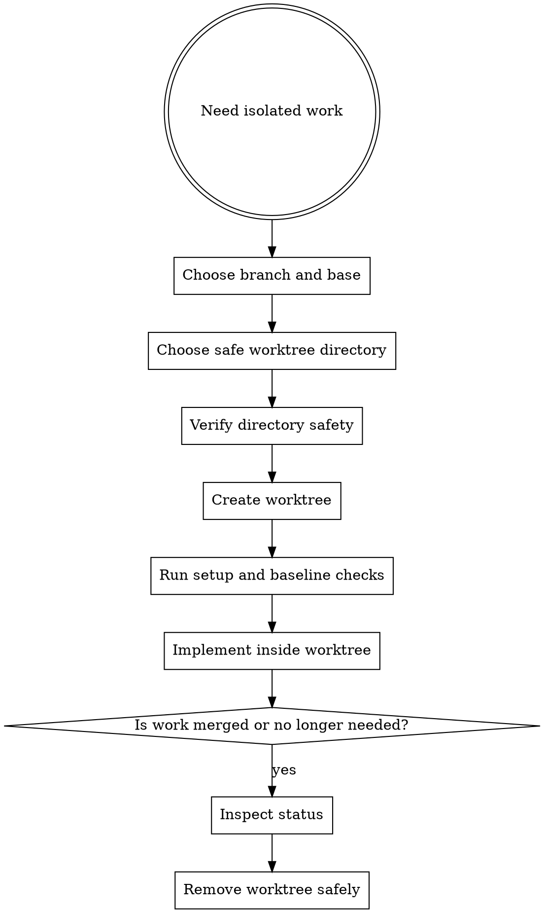

# Worktrees

Use worktrees to isolate implementation streams. They reduce branch drift, keep risky changes contained, and make parallel work safer.

## Overview

The goal is reliable isolation: choose the right directory, verify it is safe, then start from a clean baseline.

## When To Use

- starting a new requirement or plan branch
- isolating risky refactors from the main workspace
- running multiple work streams in parallel
- creating multiple worktrees for independent groups in one approved plan
- avoiding direct implementation on `main` or `master`

## Workflow



## Common Commands

```sh
agentic worktree create --branch feat/req-123 --base main
agentic worktree list
agentic worktree list --json
agentic worktree remove --path .worktrees/feat/req-123 --delete-branch
agentic worktree remove --path .worktrees/feat/req-123 --delete-branch --delete-remote
```

## Rules

- prefer one requirement or plan per worktree
- independent planned groups may use multiple worktrees, but shared groups stay together
- do not implement directly on `main` or `master` unless explicitly approved
- verify project-local worktree directories are safely ignored before using them
- run setup and baseline validation before heavy implementation work
- inspect worktree status before removal
- before starting later work, check merged PRs or merged branches and clean stale local branches/worktrees safely
- treat merged-branch cleanup as an ordered flow: status check first, worktree removal second, local branch deletion third, optional remote deletion last
- delete remote branches only when the user explicitly requests it
- use force removal only when the user accepts losing uncommitted work

## Safety Verification

For project-local worktree directories, verify they are ignored before trusting them.

If the baseline in the worktree is already failing, report that before starting implementation so new failures are not confused with existing ones.

If a plan fans out into independent lanes, create or verify multiple worktrees only for those independent groups. Shared groups stay together in one lane until their common work is done.

Before cleanup, confirm whether the branch was already merged and whether local-only commits or uncommitted changes still exist. Removal safety matters more than tidiness.

For the first-class merged cleanup path, prefer `agentic worktree remove --path <path> --delete-branch`. Add `--delete-remote` only when the user explicitly wants the remote branch removed too.

## Red Flags

Stop if:

- you are about to work directly on `main` out of convenience
- you cannot explain which branch or plan a worktree belongs to
- you are creating a project-local worktree without checking ignore safety
- baseline checks already fail but you continue as if the branch were clean
- you are removing a worktree without checking for uncommitted changes
- multiple unrelated tasks are sharing one isolation branch

## Companion Files

- `references/worktree-checklist.md`
- `cleanup-guide.md`

## Runtime Agent

- In OpenCode, prefer `@worktree` to execute or verify workspace isolation before `@coder` starts non-trivial implementation.
