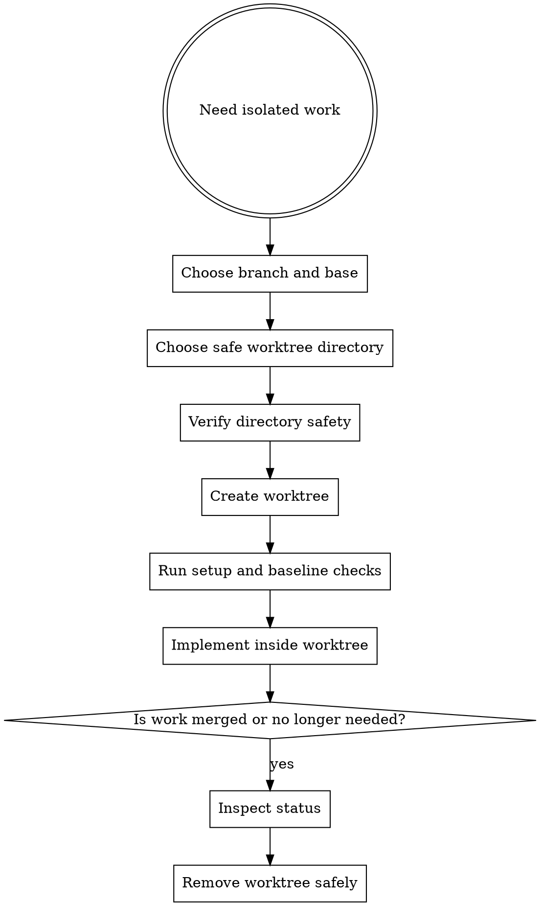

# Worktrees

Use worktrees to isolate implementation streams. They reduce branch drift, keep risky changes contained, and make parallel work safer.

## Overview

The goal is reliable isolation: detect existing isolation first, then choose the right directory, verify it is safe, and start from a clean baseline. Never fight the harness.

## Step 0: Detect Existing Isolation

Before creating anything, check if you are already in an isolated workspace:

```sh
GIT_DIR=$(cd "$(git rev-parse --git-dir)" 2>/dev/null && pwd -P)
GIT_COMMON=$(cd "$(git rev-parse --git-common-dir)" 2>/dev/null && pwd -P)
BRANCH=$(git branch --show-current)
```

**Submodule guard:** `GIT_DIR != GIT_COMMON` is also true inside git submodules. Verify you are not in a submodule:

```sh
# If this returns a path, you are in a submodule, not a worktree — treat as a normal repo.
git rev-parse --show-superproject-working-tree 2>/dev/null
```

- **If `GIT_DIR != GIT_COMMON` (and not a submodule):** you are already in a linked worktree. Skip to setup and baseline checks. Do NOT create another worktree.
- **If `GIT_DIR == GIT_COMMON` (or in a submodule):** you are in a normal repo checkout. Proceed to directory selection.

Report the detected state before doing anything else:

- on a branch: `Already in isolated workspace at <path> on branch <name>.`
- detached HEAD: `Already in isolated workspace at <path> (detached HEAD, externally managed).`
- normal repo: `In normal repo checkout at <path>; preparing to create a worktree.`

## Directory Selection

Use this priority order:

1. Existing `.worktrees/` directory in the repo.
2. Existing `worktrees/` directory in the repo.
3. Repo-local instructions that name a worktree directory.
4. Ask the user whether to use a project-local directory or an external workspace location.

For project-local directories, verify ignore safety for the actual chosen directory before creating or trusting the location. Each selected project-local root must be checked independently:

```sh
git check-ignore -q <chosen-worktree-dir>
```

If the chosen project-local directory is not ignored, stop and report the safety problem instead of creating nested tracked worktrees.

## When To Use

- starting a new requirement or plan branch
- isolating risky refactors from the main workspace
- running multiple work streams in parallel
- creating multiple worktrees for independent groups in one approved plan
- avoiding direct implementation on `main` or `master`

## Workflow



## Common Commands

```sh
agentic worktree create --branch feat/req-123 --base main
agentic worktree list
agentic worktree list --json
agentic worktree cleanup-merged --json
agentic worktree cleanup-merged --apply
agentic worktree cleanup-merged --apply --delete-remote
agentic worktree remove --path .worktrees/feat/req-123 --delete-branch
agentic worktree remove --path .worktrees/feat/req-123 --delete-branch --delete-remote
```

## Rules

- prefer one requirement or plan per worktree
- independent planned groups may use multiple worktrees, but shared groups stay together
- do not implement directly on `main` or `master` unless explicitly approved
- verify project-local worktree directories are safely ignored before using them
- use `git check-ignore` for project-local worktree directory safety checks
- run setup and baseline validation before heavy implementation work
- use Bun as the Node-family setup baseline: run `bun install` when dependencies are needed and `package.json` is present
- inspect worktree status before removal
- report the final worktree path, branch, setup command, and baseline verification result before implementation starts
- before starting later work, check merged PRs or merged branches and clean stale local branches/worktrees safely
- treat merged-branch cleanup as an ordered flow: status check first, worktree removal second, local branch deletion third, optional remote deletion last
- delete remote branches only when the user explicitly requests it
- use force removal only when the user accepts losing uncommitted work

## Safety Verification

For project-local worktree directories, verify each selected project-local root is ignored before trusting it. Use `git check-ignore` so local, global, and system ignore rules are respected.

If the baseline in the worktree is already failing, report that before starting implementation so new failures are not confused with existing ones.

After setup, report:

```text
Worktree ready at <full-path>
Branch: <branch>
Setup: <command run, or skipped with reason>
Baseline: <verification command and result>
```

If a plan fans out into independent lanes, create or verify multiple worktrees only for those independent groups. Shared groups stay together in one lane until their common work is done.

Before cleanup, confirm whether the branch was already merged and whether local-only commits or uncommitted changes still exist. Removal safety matters more than tidiness.

For the first-class merged cleanup path, prefer `agentic worktree remove --path <path> --delete-branch`. Add `--delete-remote` only when the user explicitly wants the remote branch removed too.

When you want to clean multiple merged worktrees safely, start with `agentic worktree cleanup-merged --json` to preview candidates and blockers. Only use `--apply` after reviewing the preview output.

## Red Flags

Stop if:

- you are about to work directly on `main` out of convenience
- you cannot explain which branch or plan a worktree belongs to
- you are creating a project-local worktree without checking ignore safety
- baseline checks already fail but you continue as if the branch were clean
- you are removing a worktree without checking for uncommitted changes
- multiple unrelated tasks are sharing one isolation branch

## Companion Files

- `references/worktree-checklist.md`
- `cleanup-guide.md`

## Runtime Agent

- In OpenCode, prefer `@worktree` to execute or verify workspace isolation before `@coder` starts non-trivial implementation.
