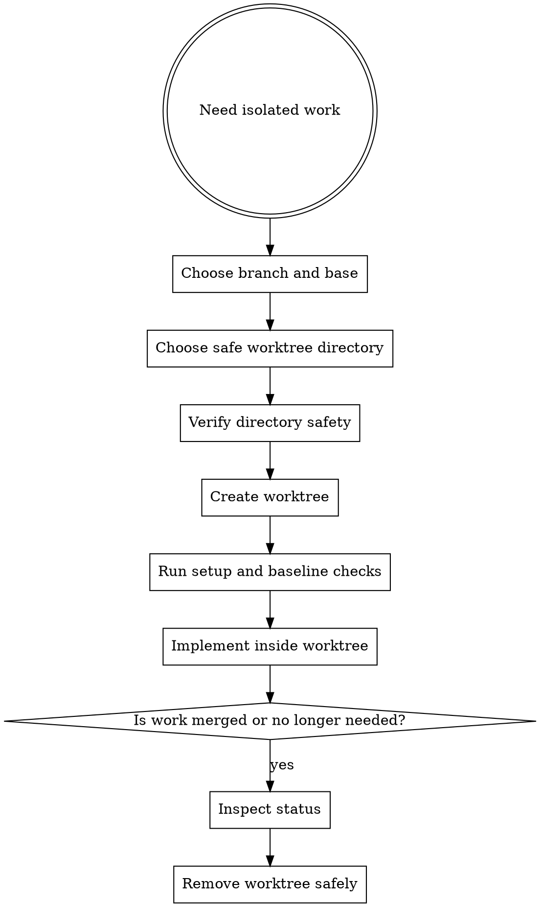

# Worktrees

Use worktrees to isolate implementation streams. They reduce branch drift, keep risky changes contained, and make parallel work safer.

## Overview

The goal is reliable isolation: choose the right directory, verify it is safe, then start from a clean baseline.

## When To Use

- starting a new requirement or plan branch
- isolating risky refactors from the main workspace
- running multiple work streams in parallel
- avoiding direct implementation on `main` or `master`

## Workflow



## Common Commands

```sh
agentic worktree create --branch feat/req-123 --base main
agentic worktree list
agentic worktree list --json
agentic worktree remove --path .worktrees/feat/req-123
```

## Rules

- prefer one requirement or plan per worktree
- do not implement directly on `main` or `master` unless explicitly approved
- verify project-local worktree directories are safely ignored before using them
- run setup and baseline validation before heavy implementation work
- inspect worktree status before removal
- use force removal only when the user accepts losing uncommitted work

## Safety Verification

For project-local worktree directories, verify they are ignored before trusting them.

If the baseline in the worktree is already failing, report that before starting implementation so new failures are not confused with existing ones.

## Red Flags

Stop if:

- you are about to work directly on `main` out of convenience
- you cannot explain which branch or plan a worktree belongs to
- you are creating a project-local worktree without checking ignore safety
- baseline checks already fail but you continue as if the branch were clean
- you are removing a worktree without checking for uncommitted changes
- multiple unrelated tasks are sharing one isolation branch

## Companion Files

- `references/worktree-checklist.md`
- `cleanup-guide.md`

## Runtime Agent

- In OpenCode, prefer `@worktree` to execute or verify workspace isolation before `@coder` starts non-trivial implementation.
